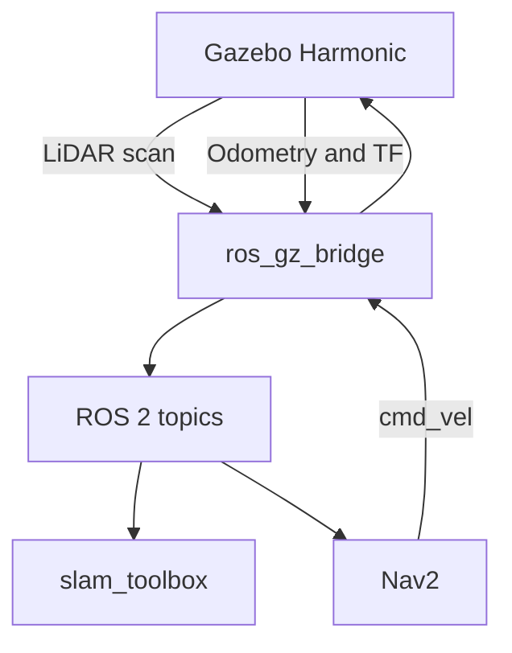

# RoamBot

RoamBot is a lightweight 2-wheel differential-drive mobile robot simulation built with ROS 2 Jazzy and Gazebo Harmonic.

It is designed as a complete autonomous-navigation project: a custom robot model drives in a simulated arena, senses walls using 2D LiDAR, builds a map with SLAM, and navigates to goals using Nav2.

## Features

- Custom RoamBot Xacro/URDF robot model
- Differential-drive motion in Gazebo Harmonic
- Wheel odometry and TF transforms
- Simulated 2D LiDAR publishing `/scan`
- Custom indoor arena with walls and obstacles
- SLAM mapping using `slam_toolbox`
- Saved occupancy-grid map
- AMCL localization on the saved map
- Autonomous goal navigation using Nav2
- ROS–Gazebo communication through `ros_gz_bridge`

## Project structure

```text
roambot_ws/
├── src/
│   ├── roambot_description/   # Robot body, wheels, caster, and LiDAR model
│   ├── roambot_simulation/    # Gazebo worlds, spawning, drive system, bridges
│   ├── roambot_navigation/    # SLAM, saved map, AMCL, and Nav2 configuration
│   └── roambot_bringup/       # Future unified launch package
├── README.md
└── .gitignore
```

## System architecture



- **Gazebo Harmonic** simulates RoamBot, the arena, physics, wheels, and LiDAR.
- **ROS 2 topics** are named data channels such as `/scan` and `/cmd_vel`.
- **ros_gz_bridge** connects Gazebo messages to ROS 2 messages.
- **SLAM** means *Simultaneous Localization and Mapping*: the robot builds a map while estimating where it is.
- **Nav2** is the ROS 2 navigation system. It plans a safe path and commands the robot to follow it.

## Requirements

- Ubuntu/Docker environment with ROS 2 Jazzy
- Gazebo Harmonic
- `ros_gz_sim`
- `ros_gz_bridge`
- `slam_toolbox`
- `nav2_bringup`

## Build

```bash
source /opt/ros/jazzy/setup.bash

cd ~/roambot_ws
colcon build --symlink-install
source install/setup.bash
```

## Run the simulation

### 1. Launch RoamBot in the arena

```bash
source /opt/ros/jazzy/setup.bash
cd ~/roambot_ws
source install/setup.bash

ros2 launch roambot_simulation arena.launch.py
```

This starts Gazebo, spawns RoamBot, starts the differential-drive system, and bridges Gazebo data to ROS 2.

### 2. Run SLAM to create a map

Open a second terminal:

```bash
source /opt/ros/jazzy/setup.bash
cd ~/roambot_ws
source install/setup.bash

ros2 launch roambot_navigation slam.launch.py
```

Open a third terminal for manual driving:

```bash
source /opt/ros/jazzy/setup.bash
cd ~/roambot_ws
source install/setup.bash

ros2 run teleop_twist_keyboard teleop_twist_keyboard
```

Use the keyboard to drive around the arena and observe the map in RViz.

### 3. Run autonomous navigation

After a map has been saved, launch Nav2:

```bash
source /opt/ros/jazzy/setup.bash
cd ~/roambot_ws
source install/setup.bash

ros2 launch roambot_navigation nav2.launch.py
```

In RViz:

1. Select **Nav2 Goal**.
2. Click and drag on a free area of the map.
3. RoamBot plans a route and drives to that goal while avoiding obstacles.

## Important ROS 2 topics

| Topic        | Meaning                                                           |
| ------------ | ----------------------------------------------------------------- |
| `/cmd_vel` | Desired forward and turning speed sent to the robot               |
| `/odom`    | Estimated robot movement based on wheel rotation                  |
| `/scan`    | Distance readings from the 2D LiDAR                               |
| `/tf`      | Coordinate-frame relationships, such as`odom → base_footprint` |
| `/map`     | The occupancy-grid map used by SLAM and Nav2                      |
| `/clock`   | Gazebo simulation time                                            |

## Navigation setup

RoamBot uses:

- **AMCL** for localization on the saved map.
- **Nav2** for planning and goal navigation.
- **Regulated Pure Pursuit** as the local controller for smoother turning in the compact arena.
- A `0.18 m` robot safety radius and inflated obstacle boundaries to avoid wall collisions.

## Verification completed

- [X] Robot model visible in RViz
- [X] RoamBot spawned in Gazebo Harmonic
- [X] Manual differential-drive control
- [X] `/odom`, `/tf`, and `/joint_states` verified
- [X] 2D LiDAR `/scan` verified in RViz
- [X] Arena map created and saved
- [X] AMCL localization verified
- [X] Nav2 autonomous goal navigation verified

## Future work

- Add a single unified bringup launch file
- Improve controller tuning using repeated route tests
- Add physical odometry calibration experiments
- Add a real-hardware version of RoamBot
- Add an RViz configuration and demo video
